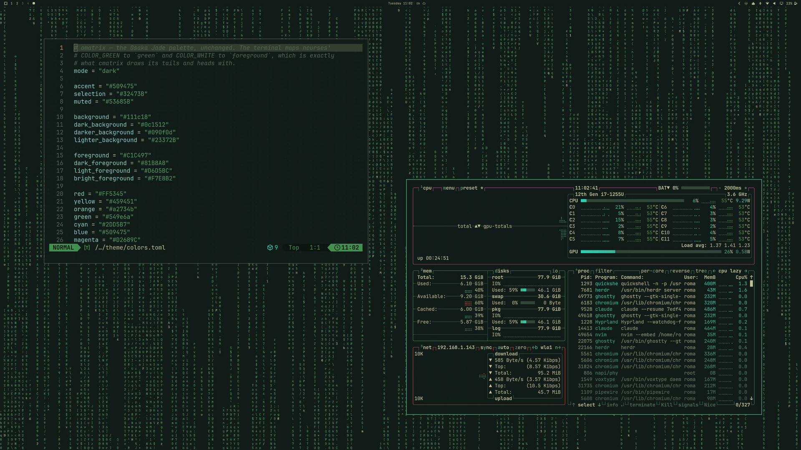

# omatrix — Omarchy theme

The desktop is the terminal: the Osaka Jade palette on the terminal's
background colour, with `cmatrix` rain falling behind your windows.



## Install

The rain is rendered by a small Omarchy shell plugin (themes can't run
code), so it's two commands:

```bash
omarchy plugin add https://github.com/0x1ocean/omarchy-omatrix.git --enable
omarchy theme install https://github.com/0x1ocean/omarchy-omatrix-theme.git
```

Without the plugin you get Osaka Jade on a plain dark wallpaper. Switching to
any other theme hides the rain; `omatrix.toml` in this repo is what switches
it on, and every key in it is a `cmatrix` flag (`-u`, `-a`, `-b`, `-c`, `-k`,
`-m`, `-o`, `-r`, `-C`) — edit it in `~/.config/omarchy/themes/omatrix/` and
re-run `omarchy theme set omatrix`.

Source, engine notes and all settings: https://github.com/0x1ocean/omarchy-omatrix

## Credits

Palette: Omarchy's Osaka Jade theme. Rain: a port of
[cmatrix](https://github.com/abishekvashok/cmatrix).
